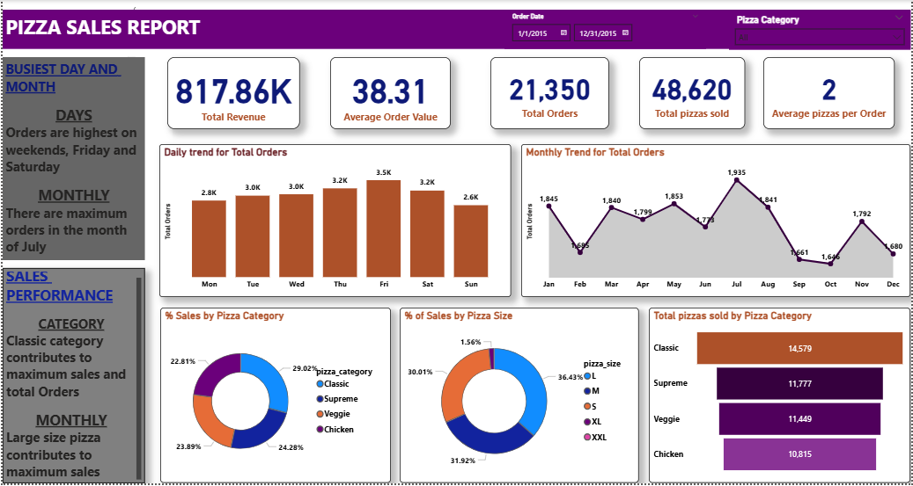

# Pizza-Sales-Report-Dashboard
This repository contains an interactive Power BI dashboard analyzing pizza sales data to provide insights into revenue, orders and product performance

---

## Objective
The dashboard provides comprehensive insights into the sales performance of the restaurant to optimize operations, identifies top performing products  and aids in understanding customer ordering patterns.The goal is to transform raw data into actionable insights, enabling better understanding of customer demand and business performance.

---

## Dataset
**Source:** Kaggle - Pizza Sales Dataset
**Time period:** January-December 2015
**Records:** Order date, Pizza Category, Pizza size, Quantity and Total Prize
**Preperataion:** Dataset was ready for analysis and loaded directly into PowerBI.

---
## Dashboard Features
- KPI cards displaying Total Revenue, Average Order Value, Total Orders and Total Pizzas sold.
- Daily and monthly trends of total orders.
- Donut Charts showing percentage of sales by pizza category and size.
- Funnel chart of total pizzas sold by category.
- Interactive Filtering for the date range and pizza category for dynamic analysis.

---

## Screnshot

---

## Tools and Technology
- Power BI Desktop
- Power Query
- DAX

---

## How to view this project
1. Download pizza_sales_report.pbix and open in PowerBI Desktop
2. View dashboard images in the screenshots.
3. Original dataset available in the files

---

## Key Insights
- **Classic pizzas** generated the highest share of revenue across 2015 having the highest total orders.
- **Large and extra large pizza sizes** contributed significantly more revenue than smaller sizes.
- **Weekend orders** especially Fridays and Saturdays consistently outperformed weekdays.
- **July** shows peak monthly performance with significant increase in both orders and revenue.

## Recommendations
- Increase marketing efforts for top-performing pizza categories on weekends to capitalize on high demand.
- Introduce bundle offers for larger pizza sizes to drive even higher revenue.
- Target promotions during low sales months to balance demand across the year.

